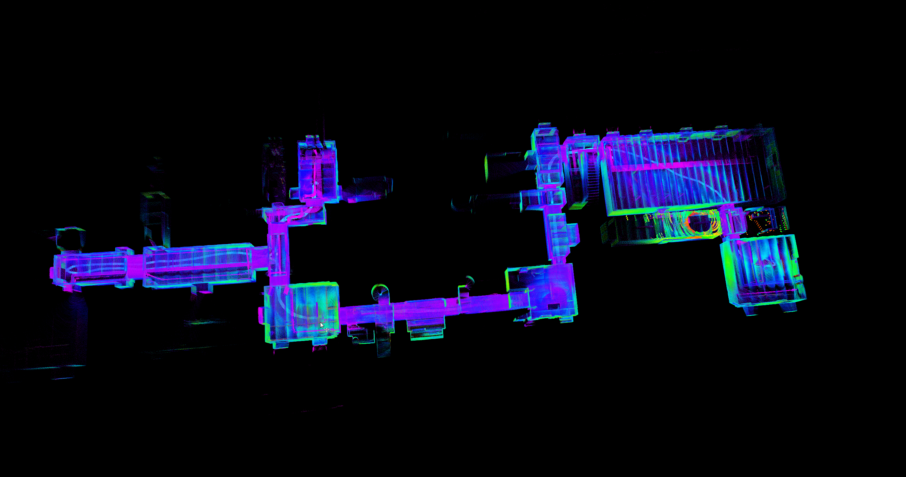
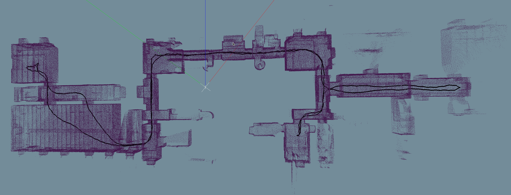

# DALI_SLAM (DA-LIO) to HDMapping simplified instruction

## Step 1 (prepare data)
Download the dataset `reg-1.bag` by clicking [link](https://cloud.cylab.be/public.php/dav/files/7PgyjbM2CBcakN5/reg-1.bag) (it is part of [Bunker DVI Dataset](https://charleshamesse.github.io/bunker-dvi-dataset)) and convert with [tool](https://github.com/MapsHD/livox_bag_aggregate) to `reg-1.bag-pc.bag`.

File `reg-1.bag-pc.bag` is an input for further calculations.
It should be located in `~/hdmapping-benchmark/data`.

## Step 2 (prepare docker)
```shell
mkdir -p ~/hdmapping-benchmark
cd ~/hdmapping-benchmark
git clone https://github.com/MapsHD/benchmark-DALI_SLAM-to-HDMapping.git --recursive
cd benchmark-DALI_SLAM-to-HDMapping
git checkout Bunker-DVI-Dataset-reg-1
docker build -t dalislam_noetic .
```

## Step 3 (run docker, file `reg-1.bag-pc.bag` should be in `~/hdmapping-benchmark/data`)
```shell
cd ~/hdmapping-benchmark/benchmark-DALI_SLAM-to-HDMapping
chmod +x docker_session_run-ros1-dalislam.sh
cd ~/hdmapping-benchmark/data
~/hdmapping-benchmark/benchmark-DALI_SLAM-to-HDMapping/docker_session_run-ros1-dalislam.sh reg-1.bag-pc.bag .
```

While the bag plays you can watch DA-LIO build the map live in RViz:



## Step 4 (Open and visualize data)
Expected data should appear in `~/hdmapping-benchmark/data/output_hdmapping-DALI_SLAM`.
Use tool [multi_view_tls_registration_step_2](https://github.com/MapsHD/HDMapping) to open `session.json` from `~/hdmapping-benchmark/data/output_hdmapping-DALI_SLAM`.



You should see the following data in folder `~/hdmapping-benchmark/data/output_hdmapping-DALI_SLAM`:

lio_initial_poses.reg

poses.reg

scan_lio_*.laz

session.json

trajectory_lio_*.csv

## Contact email
januszbedkowski@gmail.com
